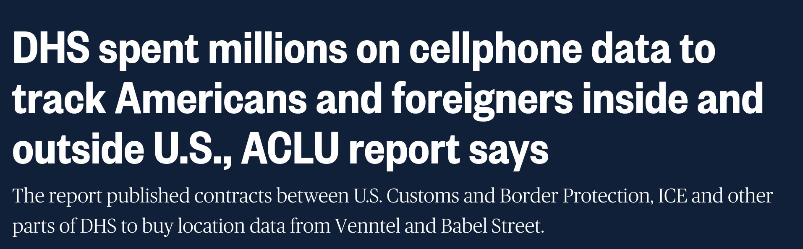
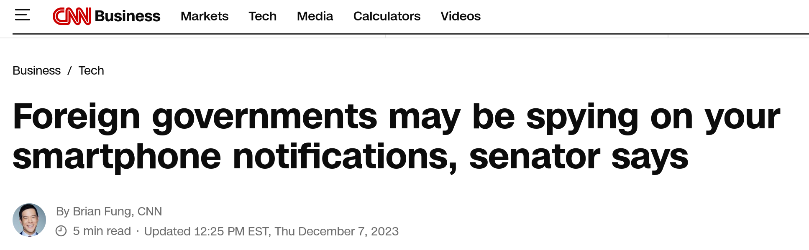
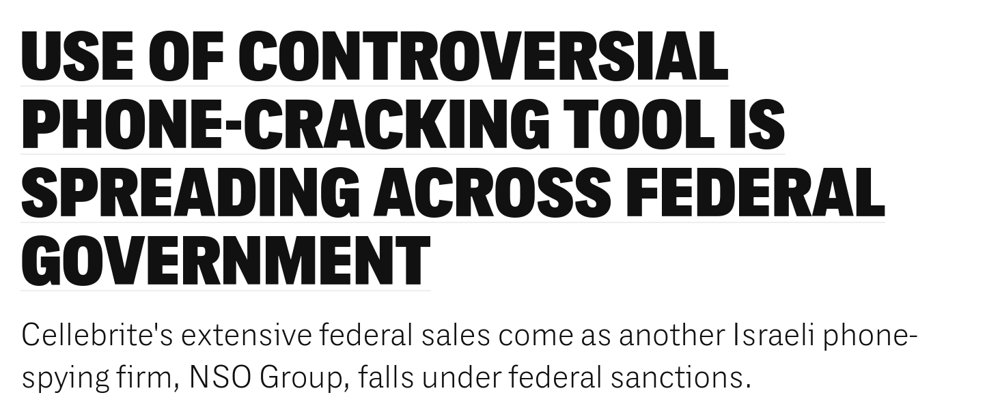
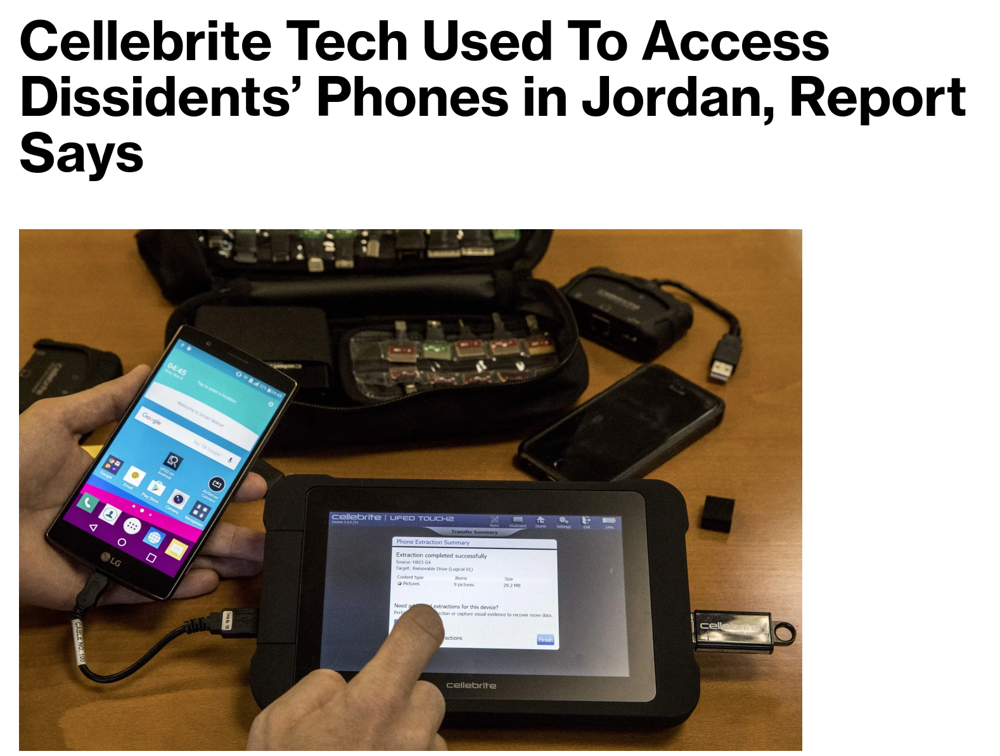
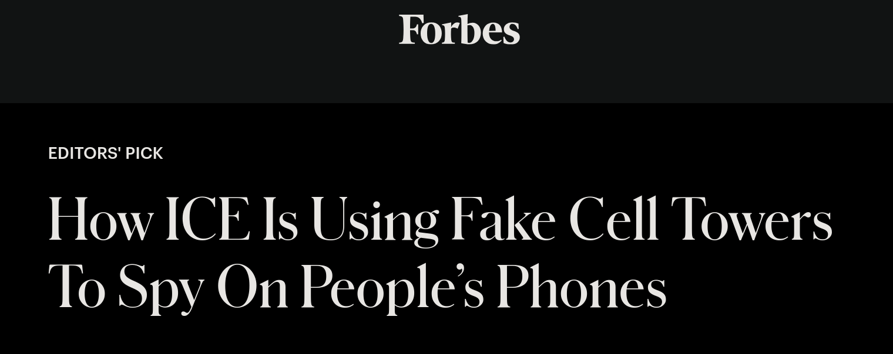
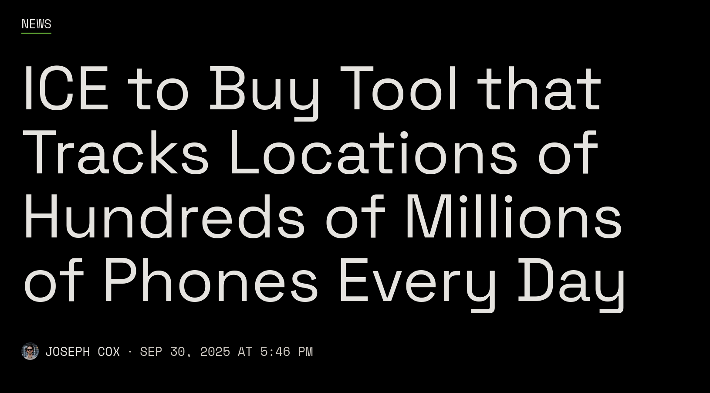
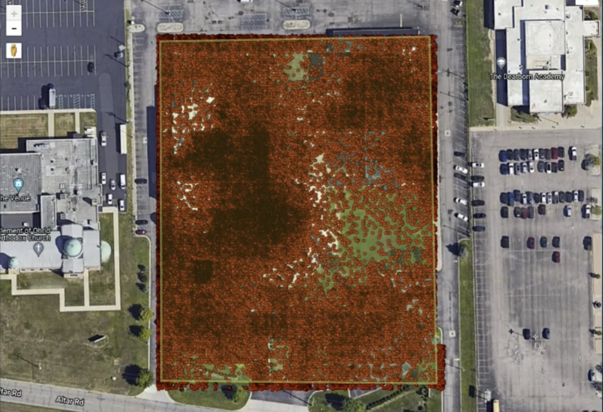
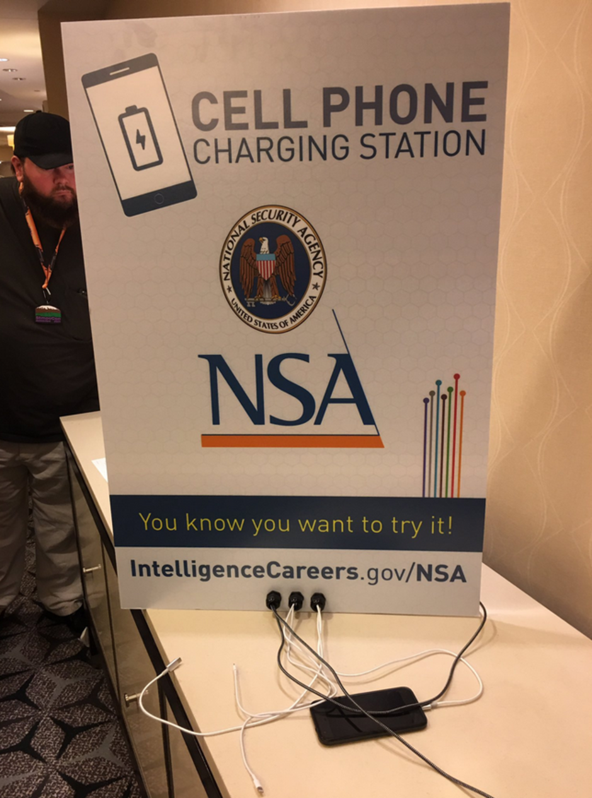

Outline
---
1. Motivation
2. Android privacy issues
3. Android's security model & exploits
4. Encryption on Android
5. Cellebrite
6. GrapheneOS's defenses
7. Practical implications
8. Citations

<!-- pause -->

<!-- end_slide -->
<!-- jump_to_middle -->

# Section 1: Motivation

Your Phone is a Federal Informant
---
<!-- pause -->

Your Phone is a Federal Informant
---

Your Phone is a Federal Informant
---

Your Phone is a Federal Informant
---

Your Phone is a Federal Informant
---

Your Phone is a Federal Informant
---

Who's At Risk?
---
- Activists
- Lawyers
- Journalists
- At-risk demographics
  - Queer people
  - People seeking abortions
  - Immigrants
- (some) security researchers

**You probably have loved ones who fall into some of these categories.**
<!-- pause -->

"I have nothing to hide"
---
- You don't have to be a criminal to be targeted by a government
- 70% of people deported by ICE had no criminal convictions¹
- Journalists and lawyers always have to be extra-diligent about opsec

This talk will focus on three categories of threats:
- Leakage of private data
- Remote device compromise
- Local device compromise

<!-- pause -->

<!-- end_slide -->
<!-- jump_to_middle -->

# Section 2: Data Privacy on Android
What data leaves your phone before anyone seizes it?

Data Brokers
---
- Data brokers are companies that **collect, buy, and sell personal data**
- Data from people's mobile phones is extremely valuable to data brokers
- SafeGraph pays app developers **$1-4 per user** per year for location data²
- Venntel gives the feds access to its database for **$20k** per 12,000 queries³
- Many data brokers have contracts worth **$500k+** with the feds²
- The mobile phone data market is worth more than **$12 billion** globally⁴
- **Google is a data broker.**
  - 75% of their revenue comes from targeted advertising⁵

<!-- pause -->

What Data Is Collected?
---
- Location
  - When GPS is disabled, Android estimates the location from nearby WiFi names⁶
- Installed apps
  - Can be used to **uniquely** fingerprint **99.4%** of users⁷
- Contacts
- Hardware IDs
- Advertising IDs
- Crash analytics, diagnostic info, etc.

<!-- pause -->

What Data Is Collected?
---
<!-- alignment: center -->
Babel Street's view of all the unique mobile devices seen in a mosque in Michigan⁸

Location Data Isn't Just For Ads
---
<!-- pause -->
If you have enough location datapoints, you can see:
- Home addresses
- A target's religion/place of worship
- Associations between people (devices that frequently appear nearby)
- People's travel history
- Lists of people who visit sensitive locations
  - Abortion clinics
  - Embassies and consulates
  - Support groups for at-risk individuals
- Protest attendance

<!-- pause -->

How Is This Data Collected?
---
- Directly through the OS by Google/Samsung/etc.
  - Samsung devices send analytics to both companies!
  - Android and iOS send telemetry every 5 minutes even while idle⁹
  - This happens even if you opt out everywhere you can⁹ ¹⁰
- App developers directly selling data to brokers or on a "bidstream" auction
- Advertising SDKs embedded in apps
  - **90%** of apps on the Google Play Store have trackers embedded in them¹¹

<!-- pause -->

Who Buys This Data?
---
- Other data brokers
- Advertisers
- Insurance companies
- Cops, FBI, DHS, ICE, etc.
  - Buying location doesn't require a warrant, but getting it from phone carriers does¹² ¹³
- The military (outside the scope of this talk)

<!-- pause -->

What About Data That Doesn't Get Sold?
---
- Data that is stored on Google/Samsung/Apple's servers but isn't sold is still a liability!
- Example: Push notifications
  - All push notifs on Android/iOS go through Google/Apple's servers (FCM/APN)
  - The feds routinely subpoena the contents of these notifications¹⁴
  - Up until recently this didn't even require a warrant in many cases¹⁵
  - With most apps, this means the cops can see **all the data in your notifications!**
  - If you're using a "secure" messaging app, the feds can get **metadata** about your messages¹⁶
  - Some apps claiming to be E2EE inadvertently leak message contents this way!¹⁶

<!-- pause -->

The Bottom Line
---
<!-- jump_to_middle -->
<!-- pause -->
**"Stock" Android does not provide any guarantee of privacy.**
<!-- pause -->
How about security?

<!-- end_slide -->
<!-- jump_to_middle -->

# Section 3: Android's Security Model & Exploits

The Basics
---
Android is based on Linux, but has its own security model layered on top.
<!-- list_item_newlines: 1 -->
- **SELinux**
  - Mandatory deny-by-default access control enforced for all processes (incl. system services)
- **Application sandboxing**
  - Each app runs as a separate Linux user / UID
  - Apps cannot access each others' data without IPC (more on this later)
  - On Android 9.0+ each app runs in a separate SELinux context¹⁷
  - On Android 10.0+ strongly limits apps' direct access to the filesystem¹⁷
- **Permissions**
  - Users have to explicitly grant apps access to location, contacts, etc.
- **Verified Boot**
  - Cryptographically verifies all stages of boot, starting from a hardware root of trust¹⁸
  - OS rollback protection (usually eFuse-based)
<!-- pause -->

Sandboxing
---
- App sandboxing has two main benefits:
  - Installing a malicious app does not immediately compromise your full system
  - A vulnerability (e.g. buffer overflow) in a legitimate app has reduced impact
<!-- new_line -->
As a result, a typical exploit chain to compromise an Android device goes:
1. Code execution in a sandboxed app
2. Sandbox escape
3. Kernel privilege escalation
4. Persistence
5. Data exfiltration

<!-- pause -->

Main Attack Surfaces
---
- Media parsing (image codecs, PDF rendering, fonts, etc.)
- Message apps & VOIP services
- Browser engines
- Baseband / modem firmware
- Local USB exploits
<!-- new_line -->
These exploits are usually used to deploy spyware for nation-states.

<!-- pause -->

Nation-State Spyware
---
- Just like with location data, there is a **large market for selling Android spyware tools to nation-states**
- Examples:
  - NSO Group's Pegasus¹⁹
  - Intellexa's Predator²⁰
  - Candiru's Sherlock²¹
- These exploits are routinely used on **journalists, dissidents, politicians, and human rights lawyers** and can be sold for millions of dollars
- Exploits are usually either 1-click (go to a page or open a file) or zero-click

<!-- pause -->

A Note About Patches
---
- The Android ecosystem is very complicated
- There are many vendors, each with their own Android versions and different hardware
- There is often a gap between patches being released and vendors (Samsung, Xiaomi, etc.) applying the patch²²
- As a result, **attackers can use publicly available n-days as 0-days**
- In 2022, variants of known vulns accounted for **40% of 0-days** exploited in the wild²²
- **Even users with very good patch hygiene can be vulnerable!**

<!-- pause -->

Android Security - Summary
---
<!-- jump_to_middle -->
**Sandboxing and strict permissioning makes remotely exploiting Android phones difficult but feasible for nation-states and advanced attackers.**
<!-- pause -->
We've talked about attackers getting data from your device through data brokers and by remotely compromising it. What if they can seize your device?

<!-- end_slide -->
<!-- jump_to_middle -->

# Section 4: Device Encryption

FDE vs. FBE
---
<!-- column_layout: [1, 1] -->
<!-- column: 0 -->
Full Disk Encryption (FDE)
- Supported on Android 5 - Android 9
- Encrypts all user data with a key protected by the user's PIN²³
- Phone calls, alarms, etc. don't work after a reboot until phone is unlocked
<!-- column: 1 -->
File-Based Encryption (FBE)
- Supported on Android 7+
- Two storage spaces for each user: Credential Encrypted and Device Encrypted
- Data which needs to be accessible before an unlock is in DE storage, all other in CE

<!-- pause -->

What's in DE Storage?
---
- Device info: IMEI, MAC addresses, patch version, etc.
- SIM card data, IMSI, etc.
- Accounts in use on device (Google **account names**, phone numbers, usernames)
- Saved WiFi networks & their **passwords**
- List of **installed apps**
  - Especially dangerous in authoritarian regimes
- Connected Bluetooth devices

All of this info comes from an excellent writeup²⁴ by Mattia Epifani
<!-- pause -->
<!-- pause -->

Secure Elements
---
- Most Android users use a 4-6 digit PIN, which obviously isn't secure for encryption
- CE files are instead encrypted with a key stored in a Secure Element
- The SE will verify a user's PIN and decrypt files if it's correct
- SE should **throttle** on failed authentication attempts
- If implemented well, this should defeat Brute Force (BF) attacks

<!-- pause -->

Secure Elements
---
Manufacturer-specific:
- Titan M2 on modern Pixels²⁵
- Knox Vault on flagship Samsungs²⁶
- ARM TrustZone TEE on midrange Samsungs
- Qualcomm Secure Execution Environment on Qualcomm-based phones
- Of these, only the **Titan M2 and Knox Vault** are discrete chips
  - TEE-based SEs are more susceptible to side-channels

If you're interested in learning more about the Titan M2, Willem Hengeveld gave an interesting talk about its firmware at last year's CCC.²⁷

<!-- pause -->

Putting It All Together
---
<!-- pause -->
An Android device can be in one of three states:
- **Before First Unlock (BFU)** - Device is locked. OS can access DE data, needs PIN to access CE
- **After First Unlock (AFU)** - Device is locked, but OS can access all data
- **Unlocked** - PIN has been entered, all data can be dumped ("Full Filesystem" / FFS extraction)

There are companies on the market who offer tools for dumping data from all 3 device states.

<!-- pause -->

<!-- end_slide -->
<!-- jump_to_middle -->

# Section 5: Cellebrite (and others)

Forensic Extraction Companies
---
<!-- pause -->
Several companies offer forensic tools for cracking mobile phones:
- Cellebrite, the most widespread
- MSAB's XRY
- Oxygen Forensic Detective
- Graykey by Grayshift/Magnet Forensics

These tools are actively used by cops in the US and abroad.

<!-- pause -->

Real-World Capabilities
---
- Official info about these products' capabilities is scarce
- Which devices & OS versions they can crack is **constantly changing**

<!-- list_item_newlines: 1 -->
My best estimate, based on marketing materials, leaked slide decks, and 404 Media's reporting:
- FFS extraction in an unlocked state: Always possible
- PIN brute force:
  - **Impossible on Pixel 6+** due to Titan M2 throttling
  - **Impossible on iPhone 12+**
  - Possible on all other Android and iOS phones
- AFU unlock:
  - Possible on **most or all phones** (latest iPhone generation unclear)
- BFU data extraction:
  - Possible on most or all phones

**In summary: The feds can crack most or all phones.**

Sources: ²⁸ ²⁹ ³⁰ ³¹ ³² ³³ ³⁴ ³⁵ ³⁶ ³⁷

<!-- pause -->

One Exception
---
<!-- jump_to_middle -->
<!-- pause -->
Per leaked Cellebrite slides, GrapheneOS on Pixel 6+ is **immune to BFU, AFU, and BF attacks.**

<!-- end_slide -->
<!-- jump_to_middle -->

# Section 6: GrapheneOS

<!-- end_slide -->
<!-- jump_to_middle -->

# Section 6: GrapheneOS (finally)

What is GrapheneOS?
---
- A FOSS fork of Android made by the nonprofit GrapheneOS Foundation
- Focused on ensuring privacy and security
- Ships without any Google services
  - Optional sandboxed Google Play Services compatibility layer
- Only supports Google Pixel devices for now
  - Partnership with an unnamed OEM is in the works³⁸
- Frequently on the cutting-edge of Android security
  - GrapheneOS security features sometimes even get merged into upstream Android
- Overall very well regarded in the security community

<!-- pause -->

Defenses Against Cellebrite et al.
---
- Configurable auto reboot (returns device to BFU state)
- Page allocator zeroing
  - Whenever any memory is freed, it is immediately zeroed out
  - Helps defend against key leakage and use-after-free attacks
- Hardware-level USB disabling
  - When device is locked, blocks any new USB connections
  - **Turns off USB data lines** on the hardware level when no existing connections left
  - Can optionally turn off USB data lines at all times

<!-- pause -->

Defenses Against Cellebrite et al.
---
You can finally use one of these safely!

Privacy-Focused Defenses
---
- Non-persistent WiFi MAC address randomization on by default
  - Every other major OS has an insecure default; see my talk from last year
- Automatically disable Bluetooth on inactivity
  - Bluetooth MACs are not randomized on any OS I know of
- Position triangulation from nearby network names off by default
  - Option to use a proxy to Apple's service
- Uses Graphene servers instead of Google ones for captive gateway connection tests, network time, etc.
  - Allows captive gateways to identify you as a Graphene user, so there's an option to use Google's servers or not do connectivity tests at all³⁹

<!-- pause -->

Privacy-Focused Defenses - Google Play Services
---
- On standard Android devices, Google Play Services run as a system application
- No way to disable them
- Google's push notification service is a privacy risk
- Graphene ships **without Google Play Services**
- Supports **optional** compatibility layer for a sandboxed Google Play Services
  - Doesn't run as a system application, reducing attack surface
  - Can be limited to just specific **user profiles**
- **Without Google Play Services, most non-system apps will not show notifications**
  - UnifiedPush⁴⁰ is a decentralized replacement which should fix this but I cannot personally vouch for its security

<!-- pause -->

Privacy-Focused Defenses - User Profiles
---
- Default Android feature but greatly expanded on Graphene
- User profiles are isolated workspaces, and have separate:
  - Apps
  - Profile data (contacts, photos, etc.)
  - CE storage and corresponding encryption keys
  - The "End Session" button on a profile **returns its data to a BFU state**
- Optional forwarding of notifications across profiles
- Can disable the ability to install apps in a specific profile

<!-- pause -->

Privacy-Focused Defenses - User Profiles
---
Good profile setup for most users:
- "Owner" profile with just an app store and almost nothing else
- Profile for trusted and sensitive apps
- Profile for untrusted apps
- Profile for apps that require Google Play Services

<!-- pause -->
Note: There is a known issue where apps and websites can communicate across profiles through localhost⁴¹
 - This is actively exploited by Meta and Yandex⁴²
 - **Avoid giving Meta/Yandex apps network permissions if possible**

<!-- pause -->

Storage & Contact Scopes
---
- When an app asks for access to your storage, you can limit its access to just specific folders or files
- **This is invisible to the app**; the application thinks it has full storage access
- You can do this with storage, photos, and contacts

<!-- pause -->

Exploit Mitigations
---
- Attack surface is greatly reduced due to Graphene removing/disabling unnecessary features
- **Hardened malloc**⁴³
  - Zero-on-free
  - Stack canaries
  - "Guard regions" around memory allocations
  - ARM memory tagging (MTE) on Pixel 8+
    - Tags every 16-byte chunk of memory with a 4-bit tag which has to match a tag in a pointer on memory access⁴⁴
- **JIT compilation disabled by default** to defend against JIT spraying attacks
  - TL;DR modern browsers use JIT to compile JS at runtime for improved performance, which leads to pages of memory being both writable and executable at the same time⁴⁵
- Option to disable dynamic code loading for user apps
- None of these mitigations are bulletproof, but combined they make exploitation **much harder**.

<!-- pause -->

Revisiting the "Patch Gap"
---
- There is an option to install security patches while they are still under embargo
- **I strongly recommend enabling this.**
- Graphene consistently deploys patches significantly quicker than other Android OEMs
  - My friend's CVE was patched on Graphene **several months earlier** than on Samsung/Google
- The only downside is that you can't see the source code of the patch until the embargo ends

<!-- pause -->

What Graphene Won't Protect You From
---
- App-layer data collection
  - If you give location permissions to a random GPS app off the Play Store, Graphene can't save you
- Cellular tracking (Stingrays, geofencing, etc.)
  - There's an option to only use LTE (4G) to defend against downgrade attacks
  - Stingrays can still track you on 4G networks⁴⁶
  - Sending unencrypted data over cellular will never be secure
- Hardware vulnerabilities
- Cops taking your device and keeping it in storage until Cellebrite finds a 0-day

<!-- pause -->

Duress PIN
---
- Optional "fake" PIN which wipes your phone
- Wiping process takes ~45 seconds and cannot be interrupted
- An activist in 2025 used it and was charged with "destruction or removal of property to prevent seizure"⁴⁷ ⁴⁸ ⁴⁹
  - Case is still pending as of this talk
- **I do not recommend using the duress PIN under most threat models.**

<!-- pause -->

Graphene Is Not For Everyone
---
- Most people just want privacy from Google, not nation-state hackers
- GrapheneOS is only available on Pixels, which most people don't have
- Some other OSs you may have heard of:
  - LineageOS⁵⁰
  - /e/OS (fork of Lineage)⁵¹
  - CalyxOS⁵²
- If you do not have a Pixel, use **/e/OS**
  - CalyxOS updates are paused
  - LineageOS does not support Verified Boot
- /e/OS is good for ensuring privacy from Google, but does not implement most of Graphene's security hardening

<!-- pause -->

<!-- end_slide -->
<!-- jump_to_middle -->

# Section 7: Using Graphene In Practice

Before You Install - Common Issues
---
- A small number of apps just don't work on Graphene
  - They rely on the Google Play Integrity API
  - If you rely on a banking app, check online to see if it works on GrapheneOS
  - A list of apps with known issues: https://grapheneos.org/articles/attestation-compatibility-guide
- Google Pay does not work
  - Relies on a key stored in the Titan M2 which is only accessible to Google

If either of these is a dealbreaker for you, you're stuck with stock Android or iOS unfortunately.

<!-- pause -->

Quickstart
---
<!-- pause -->
Installing Graphene is **extremely easy**
- Web installer for nontechnical users - https://grapheneos.org/install/web
- You do not have to use a commandline for anything

<!-- pause -->

Post-Installation Checklist:
---
- Make sure your bootloader is locked
- Create distinct user profiles
- Install FOSS apps from F-Droid, Play Store apps through Aurora Store
- Download a VPN
- Enable embargoed security updates
- Enable LTE-only mode
- Set USB-C port to charging-only
- Under a normal threat model you can leave most settings at their default

For more advanced threat models, see **https://codeberg.org/celenity/grapheneos-settings**

<!-- pause -->

<!-- end_slide -->
<!-- jump_to_middle -->

# Conclusion

A Quick Summary
---
<!-- jump_to_middle -->
- Stock Android has significant privacy and security issues
- Data brokers and nation-states routinely target Android users
- GrapheneOS significantly reduces risk but cannot protect you from everything

<!-- pause -->

A Call to Action
---
<!-- jump_to_middle -->
A security professional's job isn't just to keep companies safe.
<!-- new_line -->
<!-- pause -->
Our job is to keep **ourselves, our loved ones, and our communities** safe.

Citations
---
<!-- list_item_newlines: 1 -->
<!-- incremental_lists: false -->
1. https://www.cato.org/blog/5-ice-detainees-have-violent-convictions-73-no-convictions
2. https://www.eff.org/deeplinks/2022/06/how-federal-government-buys-our-cell-phone-location-data
3. https://vault.fbi.gov/contract-with-venntel/contract-with-venntel-part-01-of-01/view
4. https://themarkup.org/privacy/2021/09/30/theres-a-multibillion-dollar-market-for-your-phones-location-data
5. https://www.statista.com/statistics/1093781/distribution-of-googles-revenues-by-segment/
6. https://cybernews.com/security/google-pixel-9-phone-beams-data-and-awaits-commands/
7. doi:10.1038/s41598-021-82294-1
8. https://krebsonsecurity.com/2024/10/the-global-surveillance-free-for-all-in-mobile-ad-data/
9. https://www.scss.tcd.ie/doug.leith/apple_google.pdf
10. https://www.scss.tcd.ie/Doug.Leith/Android_privacy_report.pdf
11. https://arxiv.org/pdf/1804.03603
12. https://www.aclu.org/news/privacy-technology/dhs-is-circumventing-constitution-by-buying-data-it-would-normally-need-a-warrant-to-access
13. https://www.oyez.org/cases/2017/16-402
14. https://thehackernews.com/2023/12/governments-may-spy-on-you-by.html
15. https://techcrunch.com/2023/12/13/apple-push-notifications-government-warrant/
16. https://arxiv.org/html/2407.10589v1

Citations
---
<!-- list_item_newlines: 1 -->
<!-- incremental_lists: false -->
17. https://source.android.com/docs/security/app-sandbox
18. https://source.android.com/docs/security/features/verifiedboot
19. https://info.lookout.com/rs/051-ESQ-475/images/lookout-pegasus-android-technical-analysis.pdf
20. https://cloud.google.com/blog/topics/threat-intelligence/intellexa-zero-day-exploits-continue
21. https://citizenlab.ca/research/hooking-candiru-another-mercenary-spyware-vendor-comes-into-focus/
22. https://security.googleblog.com/2023/07/the-ups-and-downs-of-0-days-year-in.html
23. https://source.android.com/docs/security/features/encryption
24. https://blog.digital-forensics.it/2025/09/exploring-data-extraction-from-android.html
25. https://security.googleblog.com/2021/10/pixel-6-setting-new-standard-for-mobile.html
26. https://docs.samsungknox.com/admin/fundamentals/whitepaper/samsung-knox-mobile-security/system-security/knox-vault/
27. https://media.ccc.de/v/39c3-reverse-engineering-the-pixel-titanm2-firmware
28. https://www.404media.co/someone-snuck-into-a-cellebrite-microsoft-teams-call-and-leaked-phone-unlocking-details/
29. https://www.404media.co/leaked-documents-show-what-phones-secretive-tech-graykey-can-unlock-2/
30. https://www.404media.co/leaked-docs-show-what-phones-cellebrite-can-and-cant-unlock/
31. https://grapheneos.social/@GrapheneOS/112462756293586146
32. https://www.oxygenforensics.com/resources/ofd-mobile-extraction-methods/

Citations
---
<!-- list_item_newlines: 1 -->
<!-- incremental_lists: false -->
33. https://www.msab.com/blog/bfu-seeing-is-believing/
34. https://www.msab.com/updates/xry-11-0-xamn-8-1-unify-25-3-xec-7-13-and-kte-11-0/
35. https://cellebrite.com/en/cellebrite-premium-supersonic-delivers-industry-leading-ios-brute-force-capabilities/
36. https://stacker.news/items/774701
37. https://www.magnetforensics.com/blog/magnet-graykey-adds-full-support-for-apple-ios-17-samsung-galaxy-s24-devices-and-pixel-67-devices/
38. https://www.reddit.com/r/GrapheneOS/comments/1o4j9ia/comment/nj4wni8/
39. https://grapheneos.org/faq#default-connections
40. https://unifiedpush.org/
41. https://github.com/GrapheneOS/os-issue-tracker/issues/4768
42. https://arstechnica.com/security/2025/06/meta-and-yandex-are-de-anonymizing-android-users-web-browsing-identifiers/
43. https://grapheneos.org/features#exploit-mitigations
44. https://arxiv.org/pdf/2601.11786v1
45. https://cseweb.ucsd.edu/~savage/papers/NDSS17.pdf
46. https://arxiv.org/abs/2405.00793
47. https://www.404media.co/man-charged-for-wiping-phone-before-cbp-could-search-it/
48. https://www.documentcloud.org/documents/26363121-samuel-tunick-indictment/
49. https://www.law.cornell.edu/uscode/text/18/2232
50. https://lineageos.org/
51. https://e.foundation/
52. https://calyxos.org/